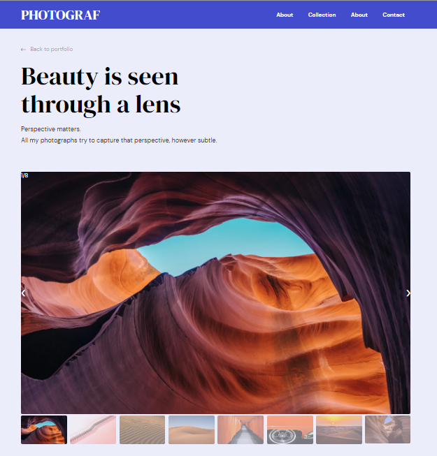

# Front-end final mockup-to-website project
 
<h1 align="center">Photograph</h1>

<div align="center">
  <h3>
    <a href="https://photograph-rinon.netlify.app/"
      Demo
    </a>
    <span> | </span>
    <a href="https://github.com/ganamavo/front-end-finals">
      Solution
    </a>
  </h3>
</div>

<!-- TABLE OF CONTENTS -->

## Table of Contents

-   [Overview](#overview)
    -   [Built With](#built-with)
-   [Features](#features)
-   [How to use](#how-to-use)
-   [Contact](#contact)
-   [Acknowledgements](#acknowledgements)

<!-- OVERVIEW -->

## Overview


 
1.  My demo can be seen by following this [link](https://photograph-rinon.netlify.app/)
1.  Some experience:
  - Building an existing website of a photographic company. This is actually the homepage with small details on the pages that the whole website has. 

1.   What I have learned and improved:
  - Working with image sliders is one of the new skills that I get from building this website. Apart from that, I learned how to use a function to generate fonts with sass.
  
1. Wisdom to share:
The best way to improve is to be motivated and always confident to face challenges no matter how difficult it will be.

### Built With
 
- [Sass](http://www.mailplanet.com/@sass.com)
- [HTML] (https://html.com/)

## How To Use 

To clone and run this application, you'll need [Git](https://git-scm.com) and [Node-sass](https://docs.npmjs.com/cli/v6/commands/npm-install)) installed on your computer. From your command line:

```bash
# Clone this repository
$ git clone https://github.com/ganamavo/front-end-finals

# Install dependencies
$ npm install

# Run the app
npm run scss:watch

```
-   GitHub [@ganamavo](https://github.com/ganamavo)
-   Twitter [@twitter](https://twitter.com/RTendrinomena)
